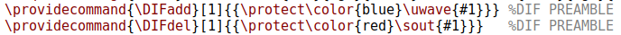
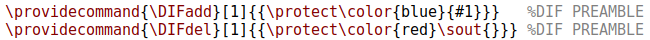
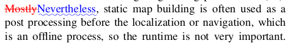
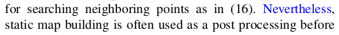

# Introduction

오늘은 Robotics와는 크게 관련은 없으나, 논문을 작성할 때 대학원생들에게 도움이 될만한 팁들을 정리하고자 한다. 필자도 돌이켜보면 그 누구도 '효율적인 논문 작성 방법'을 알려주지 않아서, 굉장히 비효율적으로 논문 작성을 해왔었다. 
하지만 박사 졸업 후 [Cyrill Stachniss 교수님](https://www.ipb.uni-bonn.de/) 네에 visiting scholar로 있으면서 함께 논문을 쓰면서, 다른 연구실의 논문 작성 procedure을 경험해볼 기회를 가졌다.
이를 통해 몇 가지 깨달은 것을 미리 정리하고자 한다. 정량적으로 얼마만큼 효율적으로 되었는가에 대해서 누가 물어본다면, 논문을 작성하기 위한 개발부터 작성까지 원래 두세 어달은 걸렸던 거 같은데, 약 한 달 정도 걸리게끔 기간을 단축할 수 있었다.
이 글을 모든 대학원생들과, 대학원생들을 지도해야할 지도교수님들에게 바친다(?). 

## Rule Number One: 모든 System을 한 OS에 통합할 것

필자는 이 때까지 논문을 작성할 때, 실험은 Ubuntu에서 하고 논문 작성 및 figure 그리기는 Window에서 하였다. 많은 대학원생이 duel booting을 통해 Window/Ubuntu를 둘 다 사용할 것이다. 하지만 이렇게 각각의 OS에서 논문 작성을 하는 것이 **매우 비효율적**이라는 것을 깨달았다. 특히, 그림을 illustrator나 power point로 그리는 사람들이 많을 것이다. 하지만 우리가 사용하는 기능을 얼마 되지 않기 때문에, Figure 그리는 것도 [Inkscape](https://inkscape.org/)로 그릴 것을 추천한다.

그래서 추천하고자 하는 방식은 다음과 같다.

* Ubuntu local에서 논문작성을 할 수 있게 TexStudio 설치

```
$ sudo apt-get install texlive-latex-base texlive-fonts-recommended texlive-fonts-extra texlive-latex-extra texlive-font-utils texlive-science texlive-extra-utils
$ sudo apt install texstudio
$ (optional) sudo apt install latexdiff
```    
**Overleaf 쓰지 마세요!!!!** Local에서 작성해야 하는 이유는 크게 두 가지와 같다.

1. 컴파일 속도가 Overleaf에 비해 월등하게 빠르다 ★★★★★. 로컬에서 compile하면 학회지 같이 한 8페이지 정도는 거의 3초 이내로 컴파일이 된다. 한 번 컴파일에 수 십초가 걸리는 Overleaf에 비해 훨씬 시간을 아낄 수 있다. 그리고 논문 작성하면서 적어도 수 백번은 컴파일할텐데, 그 시간이 쌓이고 쌓이면 상당히 큰 차이가 난다.
2. 로컬에서 작업하고 Github를 통해 버전관리를 하면 충분히 효율적으로 다른 저자들과 커뮤니케이션할 수 있음 (물론 Overleaf도 Github 연동 기능이 있음)


* Ubuntu local에서 그림 또한 그릴 수 있게 Inkscape 설치

```
$ sudo apt-get install inkscape (enter)
```
Inkscape는 주로 기업 symbol 등을 그리는 데에 사용되는데, vector image를 생성해내는 데에 특화되어 있다. 따라서 논문에 그림을 넣을 때 aliasing도 방지할 수 있다. 대다수가 PPT의 GUI에 익숙해져 있다 보니 GUI가 좀 낯선 것은 사실이다. 하지만 적응되면 Ubuntu → Window → Ubuntu로 컴퓨터를 껐다켜야하는 비효율적인 짓을 하지 않아도 된다. 


latex을 활용해 논문 작성을 할 때 버전 관리 및 수정 부분을 자동으로 highlight해주는 latexdiff와 latexpand의 사용법에 대해 알아보도록 한다.

## Latexdiff과 latexpand를 활용한 효과적인 논문 검토

오늘은 Robotics와는 크게 관련은 없으나, latex을 활용해 논문 작성을 할 때 버전 관리 및 수정 부분을 자동으로 highlight해주는 latexdiff와 latexpand의 사용법에 대해 알아보도록 한다.

결과부터 보여주자면,

command 기반으로 latex의 history를 관리할 수 있는 명령어

```
# For installation of `latexdiff`
$ sudo apt install latexdiff
# For installation of `latexpand`
$ apt-get install texlive-extra-utils
```

둘 다 설치가 완료돼었다면, 
```
latexdiff --help
latexpand --help
```
라고 하면 뭐가 떠야 됨!

덧: 간혹 논문 workspace는 window로, 실험 workspace는 Ubuntu로 이분화해서 사용하는 이들이 있는데, 이는 비효율적이다.

아래의 명령어를 통하면 바로 latex을 Ubuntu에서 수정/작성할 수 있게끔 latex 컴파일러를 설치하고 Tex Studio를 설치할 수 있다:

```
$ sudo apt-get install texlive-latex-base texlive-fonts-recommended texlive-fonts-extra texlive-latex-extra texlive-font-utils texlive-science
$ sudo apt install texstudio
```


## How to install

### Latexdiff

Overleaf 공식 홈페이지에서 [latexdiff 설치 방법](https://www.overleaf.com/learn/latex/Articles/Using_Latexdiff_For_Marking_Changes_To_Tex_Documents)을 알려줌

https://github.com/ftilmann/latexdiff/에서 다운받아서 Documents\latexdiff에 넣음


```bash
latexpand main.tex > v2.tex
```

```bash
latexdiff v1_1.tex v2.tex > diff.tex
```
---
아래 줄을 



이렇게 고치면



물결이 없고 빨강이 없게 출력이 됨!

---

### 결과

고치기 전



고치기 후


