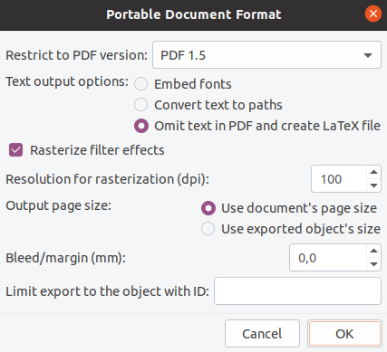

# Introduction

오늘은 Robotics와는 크게 관련은 없으나, 논문을 작성할 때 대학원생들에게 도움이 될만한 팁들을 정리하고자 한다. 필자도 돌이켜보면 그 누구도 '효율적인 논문 작성 방법'을 알려주지 않아서, 굉장히 비효율적으로 논문 작성을 해왔었다. 
하지만 박사 졸업 후 [Cyrill Stachniss 교수님](https://www.ipb.uni-bonn.de/) 네에 visiting scholar로 있으면서 함께 논문을 쓰면서, 다른 연구실의 논문 작성 procedure을 경험해볼 기회를 가졌다.
이를 통해 몇 가지 깨달은 것을 미리 정리하고자 한다. 정량적으로 얼마만큼 효율적으로 되었는가에 대해서 누가 물어본다면, 논문을 작성하기 위한 개발부터 작성까지 원래 두세 어달은 걸렸던 거 같은데, 약 한 달 정도 걸리게끔 기간을 단축할 수 있었다.
이 글을 모든 대학원생들과, 대학원생들을 지도해야할 지도교수님들에게 바친다(?). 

## Rule Number One: 모든 System을 한 OS에 통합할 것

필자는 이 때까지 논문을 작성할 때, a) 실험은 Ubuntu에서 하고 b) 데이터를 적절히 저장하거나 screenshot을 촬영한 후 c) Window로 넘어가서 논문 작성 및 figure 그리기를 하였다.
많은 대학원생이 duel booting을 통해 Window/Ubuntu를 둘 다 사용할 것이다. 
하지만 이렇게 각각의 OS에서 논문 작성을 하는 것이 **매우 비효율적**이라는 것을 깨달았다. 왜냐하면 그림을 그리려고 했는데, 추가적으로 데이터가 필요한 경우를 생각해보자. Window 종료 → Ubuntu에서 다시 전부 켜서(e.g. docker, command 창 등등) 실험 → Window로 돌아가서 다시 그림그리기 시도를 해야한다. 얼마나 비효율적인가? 하지만 필자도 박사 과정동안은 그 과정이 당연하다고 생각해서 이 짓(?)이 비효율적이라는 것을 인지하지 못 했었다. 부디 이 글을 읽는 이는 필자처럼 비효율적으로 논문 작성을 하지 말길...

또한 그림을 illustrator나 power point로 그리는 사람들이 많을 것이다. 하지만 우리가 사용하는 기능을 얼마 되지 않는다. Illustrator는 솔직히 말하면 too much다. 개인적으로 Computer Vision이나 Robotics에 종사하는 이들이라면 Figure 그리는 것은 [Inkscape](https://inkscape.org/)면 충분하다고 생각된다. ~생명과처럼 Cell들을 직접 그려야한다면 얘기가 좀 다를 수 도 있다~.

그래서 추천하고자 하는 방식은 아래와 같다: 1) TexStudio 설치, 2) Inkscape 설치

### 1. Ubuntu local에서 논문작성을 할 수 있게 Textudio 설치

```
$ sudo apt-get install texlive-latex-base texlive-fonts-recommended texlive-fonts-extra texlive-latex-extra texlive-font-utils texlive-science texlive-extra-utils
$ sudo apt install texstudio
$ (optional) sudo apt install latexdiff
```    
**Overleaf 쓰지 마세요!!!!** Local에서 논문 작성해야 하는 이유는 크게 두 가지와 같다.

1. 컴파일 속도가 Overleaf에 비해 월등하게 빠르다 ★★★★★. 로컬에서 compile하면 학회지 같이 한 8페이지 정도는 거의 3초 이내로 컴파일이 된다. 한 번 컴파일에 수 십초가 걸리는 Overleaf에 비해 훨씬 시간을 아낄 수 있다. 그리고 논문 작성하면서 적어도 수 백번은 컴파일할텐데, 그 시간이 쌓이고 쌓이면 상당히 큰 차이가 난다.
2. 로컬에서 작업하고 Github를 통해 버전관리를 하면 충분히 효율적으로 다른 저자들과 커뮤니케이션할 수 있음 (물론 Overleaf도 Github 연동 기능이 있음). Overleaf의 강점이 동시다발적으로 여러 명이 논문 작성을 할 수 있다는 점이긴 하지만, 실제로 논문을 작성할 때 모든 이들이 모든 시간동안 논문 작성을 하지는 않는다. 따라서 굳이 동시다발적으로 작업하는 것을 고려해야할 필요가 있을까하는 의문이 있다.

*추가로 꿀팁*을 주자면 논문 작성 동안에는 `\usepackage{hyperref}`를 주석해두자. Reference의 hyperlink를 만드는 과정이 생각보다 컴파일하는 데에 시간이 많이 걸린다.


### 2. Ubuntu local에서 그림 또한 그릴 수 있게 Inkscape 설치

```
$ sudo apt-get install inkscape (enter)
```

Inkscape는 주로 로고 등을 그리는 데에 사용되는 툴인데, open source여서 내 소속이 바뀌더라도 어디서든지 사용할 수 있다는 강점이 있다. 또한, vector image를 생성해내는 데에 특화되어 있다. 따라서 논문에 그림을 넣을 때 aliasing도 방지할 수 있다. 대다수가 PPT의 GUI에 익숙해져 있다 보니 GUI가 좀 낯선 것은 사실이다. 하지만 적응되면 Ubuntu → Window → Ubuntu로 컴퓨터를 껐다켜야하는 비효율적인 짓을 하지 않아도 된다. 처음인 사람들은 아래 링크를 따라서 몇 번해보면 금방 익숙해질 것이다: 

https://www.dropbox.com/s/1z1up9m8tme637p/How_to_Use_Inkscape%20.pdf?dl=0

**Advanced** 그림과 text를 함께 작성해야할 경우에 `Omit text in PDF and create LaTex file`를 사용하면 text들을 그림에 embeding하는 게 아니라 그림 object 따로, text 따로 저장하게 된다.



이는 아래와 같은 명령어로 불러올 수 있다.
```
\begin{figure}[t!]
	\captionsetup{font=footnotesize}
	\centering
	\def\svgwidth{0.48\textwidth}
	\graphicspath{{pics/fig1/}} % important! Pdf가 있는 위치를 지정해 줘야 함. 그러면 ${해당 주소}/${아래 input의 파일 명}.pdf가 불러와 짐
	\input{pics/fig1/fig1.pdf_tex}
	\caption{BLABLA.}
	\label{fig:fig1}
\end{figure}
```

뭔가 어려워 보이지만, 아래와 같이 세 가지 장점이 있다. 개인적인 욕심으로는 모든 이들에게 이 방식으로 작성하기를 추천한다

* Font size가 latex 파일에 맞춰서 작성된다. 따라서 그림이 좀 더 일관성있게 보임
* Figure 내에 citation을 자동으로 수정해줄 수 있게끔 할 수 있다. 예로 들어서 `\cite{lim2023iros}`이라는 reference가 있다고 할 때, 기존의 방식으로 논문을 작성을 할 때는 논문에 충분히 레퍼런스들을 다 넣은 후, 직접 텍스트로 "BLABLA [#]"과 같이 써줬다. 하지만 위의 방식대로 내보내기를 하면, Inkscape에서 "BLABLA~\cite{lim2023iros}"라고 적으면 컴파일 할 때 자동으로 "BLABLA [#]"으로 변경해준다. 만약 논문 작성하다 reference를 추가적으로 수정해서 reference의 숫자가 밀려졌거나 당겨졌다고 생각해보자. 그럴 경우 기존의 방식은 다시 파일을 열어서 숫자를 수정해줘야 했다면, 이 방식은 자동적으로 citation의 숫자를 업데이트해줄 수 있다.
* 한 가지 더 tricky한 부분이 있는데, 예시를 보여주고 싶은데 논문이 리뷰중이라...리뷰가 끝나면 올리겠음 (12, Feb., 2023 
