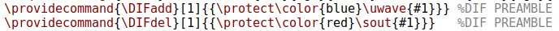
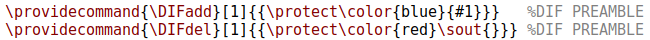
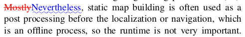

# Latexdiff과 latexpand를 활용한 효과적인 논문 검토

논문을 작성 후, 공동 저자들과 얘기를 할 때 버전 관리 및 수정 부분을 자동으로 highlight해주는 latexdiff와 latexpand의 사용법을 소개한다(진짜 넘모 편해요 여러분...꼭 쓰세요...지도 교수님이 좋아하실지도,,,?).

Latexdiff는 command 기반으로 latex에서 달라진 부분을 자동으로 highlight해준다.

### How to install

```
# For installation of `latexdiff`
$ sudo apt install latexdiff
# For installation of `latexpand`
$ apt-get install texlive-extra-utils
```

둘 다 설치가 완료돼었다면, 
```
latexdiff --help
latexpand --help
```
라고 하면 뭐가 떠야 됨!

만약 Window에서도 latexdiff를 사용하고 싶다면, Overleaf 공식 홈페이지에서 [latexdiff 설치 방법](https://www.overleaf.com/learn/latex/Articles/Using_Latexdiff_For_Marking_Changes_To_Tex_Documents)을 따라 하면 된다.

필자의 경우 https://github.com/ftilmann/latexdiff/ 에서 파일을 다운받아서 Documents\latexdiff에 넣으니 Window cmd에서도 사용이 가능한 것을 확인했다.


### How to use

1. 먼저 latexpand 명령어를 이용해서 모든 tex 파일을 하나로 취합해야 한다.

```bash
latexpand main.tex > v2.tex
```

2. 그 후 `latexdiff` 명령어를 통해 highlight된 문서를 생성한다. 

```bash
latexdiff v1_1.tex v2.tex > diff.tex
```

위의 명령어는 `v1_1.tex`로부터 `v2.tex`에 추가되거나 삭제된 부분을 highlight해서 `diff.tex`를 만들어 달라는 뜻이다.

그 후 Texstudio에서 diff.tex를 생성하면 된다!

---
추가적으로, 고친 부분이 너무 많다면, 아래와 같이 명령어를 수정하면 현재 남아있는 부분만 highlight할 수 있다.

아래의 부분을 



다음과 같이 고치면:



물결이 없고 빨강이 없게 출력이 됨! 

---

### 결과

고치기 전



고치기 후


