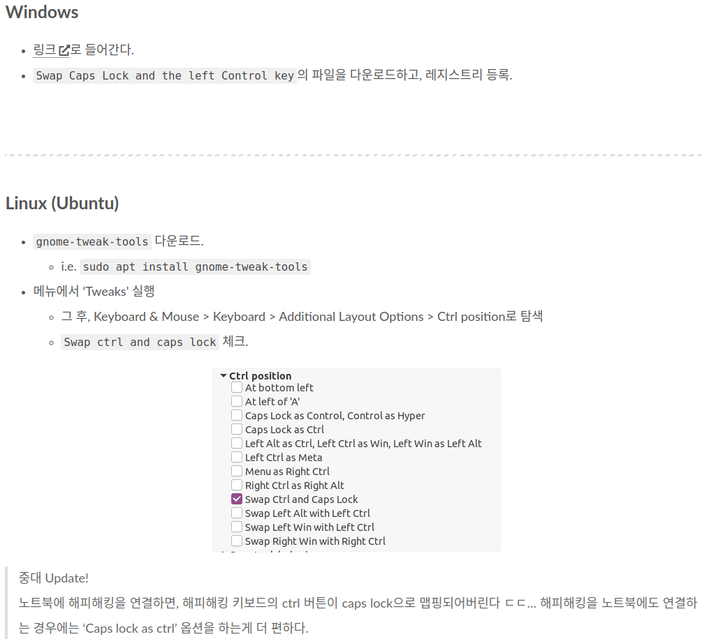

# Introduction

오늘은 Clion과 IdeaVim 세팅을 하는 방법에 대해 다뤄보고자 한다. 필자는 원래 C++을 통한 ROS 관련 세팅할 때 Clion을 사용했는데, 박사를 졸업한 기념(?) heavy VIM user가 되고 싶어서 [LunarVim](https://www.lunarvim.org/) 세팅을 하던 도중, i) LSP, linter 등에 대한 지식 부족과 ii) '나 연구해야하는데 너무 여기 시간을 많이 쓰는데...?'라는 것을 깨달아서 다시 JetBrains 성님들 IDE로 돌아왔다. LunarVim은 확실히 잘 만든 VIM + IDE이지만, 만약 python 코딩 시 Pycharm의 강력한 Debugging 기능을 LunarVim에서 스스로 구축해서 코드를 돌려야할 생각을 하니, 그냥 JetBrains이 만든 IDE를 사용하기로 했다.

최근 독일에 방문 연구원을 다녀오면서 [Nacho](https://www.ipb.uni-bonn.de/people/ignacio-vizzo/)의 Vim 세팅 및 LunarVim을 통한 Vim 세팅을 통해 보다 효과적으로 Clion 세팅을 하고자 한다.

## 1. 좌측의 `CapsLock` and `Ctrl` Swap 

먼저, 편의를 위해, Ctrl키와 CapsLock(이하 Cap)키를 변경한다. 변경하는 이유는 다음과 같다.

1. Cap키에 비해 Ctrl키의 빈도수가 월등히 높은데, Ctrl키가 너무 왼쪽 끝에 위치함
2. `Ctrl+C`나 `Ctrl+v` 시 손목의 무리가 감 (하지만 키를 바꾸면 안→밖으로 손목을 돌릴 필요가 없음!★★★★)
3. Vim에서 `Ctrl+h`(한 글자 지우기), `Ctrl+w`(한 단어 지우기), `Ctrl+u`(한 줄 지우기) 같은 기능을 쓸 때 가까워짐 
무튼 '그것까지 바꿔야 해?'하겠지만, 코딩 뿐만 아니라 ppt를 만든다던가, 글을 쓴다던가 할 때에도 Ctrl키를 굉장히 많이 쓰기 때문에, 처음에는 불편하지만 시간일 지날수록 편해지는 장점이 있다.

하는 방법은 굉장히 쉬운데, 마침 형기님이 세팅하는 법을 정리해두셨다!
(원본은 [여기](https://www.cv-learn.com/20210325-ctrl-capslock-swap/)! 갓-형기...)




Window 링크는 [https://johnhaller.com/useful-stuff/disable-caps-lock](https://johnhaller.com/useful-stuff/disable-caps-lock)를 참고하면 된다.

---

Apr.1.2024 Update

In Ubuntu 22.04, please follow

```
$ sudo add-apt-repository universe
$ sudo apt install gnome-tweaks
```

---

써본 후기
- 처음에 한 30분은 페터 빅셀의 '책상은 책상이다'에 나오는 것처럼, 혼자서 '책상을 의자라고 부르고 있는게 아닌가, '이게 맞나' 싶을 정도로 헷갈린다.
- 하루에서 이틀 지나게 되면 새끼 손가락이 약간 저릿저릿하다. 새끼 손가락 근육이 단련되는 느낌? Ctrl이 좌측 하단에 있을 때 보다 뻗어서 눌러야 하니 손날쪽 근육이 더 쓰여져서 그런 듯하다.
- 한 일주일 지나면 '아니 내가 왜 Cap키 따위에게 이러한 귀중한 위치를 양보해주고 있었던 거지?' 싶음. 특히 노트북이 flat하고 몸과 키보드가 훨씬 가깝다보니 손목에 더 무리를 야기하는데, 노트북 자판에서 훠어어어어얼씬 편해짐


