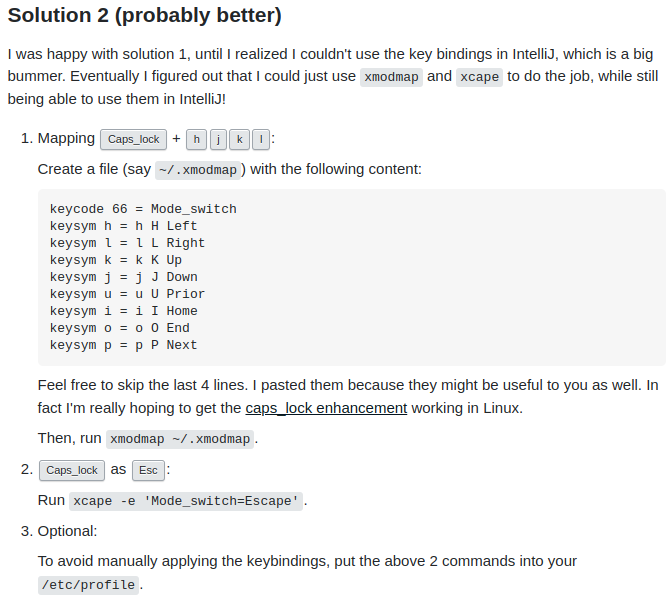

## CapsLock + hjkl를 통한 방향키 세팅

CapsLock(이하 Cap)을 [이전]()에서 구석탱이로 보냈지만, 아직 활용할만한 구석이 있다. 다음으로, Cap 통해 hjkl를 각각 왼쪽, 윗쪽, 아랫쪽, 오른쪽 방향키로 바꾸는 세팅을 한다. 그렇게 되면 Vim의 insert 모드에서 효율적으로 움직일 수 있다, e.g. 한 칸 움직일 때 insert mode를 나올 필요 없이/굳이 오른손을 화살표로 옮길 필요 없이 움직일 수 있다. Vim에서 뿐만 아니라 모든 컴퓨터 환경에서 사용할 수 있기 때문에, 적응이 되면 좀 더 편할 수 있다.


[여기](https://unix.stackexchange.com/questions/414926/bind-capshjkl-to-arrow-keys-caps-to-esc)의 Solution 2를 따르면 된다.



**그런데**, 우리는 현재 Capslock키가 Ctrl Keycode로 변경되어 있다. 따라서 다음과 같이 변경해줘야 한다.

왼쪽의 특수키의 Keycode는 순서대로

* Keycode of Capslock - 66
* Keycode of Shift - 50
* Keycode of Ctrl - 37

이다. 이 Keycode는 입력으로 들어오는 값이 아니라 keyboard 키의 하드웨어적인 위치를 칭하는 값인 것 같다. 따라서 아래와 같이 수정해줘야 한다.

```
keycode 37 = Mode_switch
keysym h = h H Left
keysym l = l L Right
keysym k = k K Up
keysym j = j J Down
keysym u = u U Prior
keysym i = i I Home
keysym o = o O End
keysym p = p P Next
```

그 후 터미널 창에서 source해주듯이

```
$ xmodmap ~/.xmodmap
```

해주면 된다 (현재 저는 쉘 파일 내, i.e. `~/.zshrc`,에 넣어 둠!).

그렇게 되면 Cap + hjkl로 방향키를 사용할 수 있게 된다! 잘 쓰이지 않지만, 오른손이 방향키로 움직이기 vs 왼손 새끼를 원래 Ctrl키로 옮기기의 cost를 따져봤을 때, 후자가 좀 더 경제적일지도...? (지극히 개인적 의견)

추가적으로 terminator 상에서 탭을 변경할 때 `Ctrl+PgUp/PgDn`으로 할 수 있는데, 현재까지의 세팅으로는 `Ctrl+Capslock+p`와 `Ctrl+Capslock+u` 로 사용할 수 있다. 무튼 손이 멀리 안 나가니 편함!~~이거 편한거 맞아?~~

(**23.03.26** 단축키를 Terminator 상에서 세팅해서 그냥 사용 중. 자세한건 [여기]() 참조)

사실 나의 Vim 스승인 Nacho는 Capslock키와 hjkl를 물려서 사용하고, Capslock키를 ESC키로 대체해서 사용했는데, 나는 Ctrl키가 더 중요한거 같고, ESC 같은 경우에는 vim에서 jk로 매핑하여 사용하고 있어서 필요성이 상대적으로 덜 하였다. 

