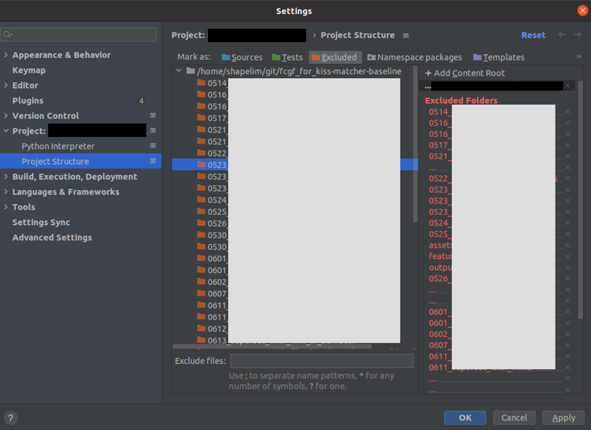

Pycharm을 이용해서 어떤 프로젝트를 작업할 때, 특정 폴더를 indexing에서 제외하고 싶을 때가 있다.
예로 들어서, deep learning network를 inference한 후의 output인 폴더에 대해서는 굳이 indexing을 할 필요가 없는데, 이 폴더가 너무 크다거나 파일의 수가 많은 경우에는 indexing을 하는데 시간이 상당히 소요된다. 
그래서 이를 제외하고 싶을 때가 있는데, 이를 위해서는 아래와 같이 `File`→`Setting`→`Project`→`Project Structure`에서 설정하면 된다.

먼저 제외하고 싶은 폴더를 선택한 후, Excluded를 누르기만 하면 폴더들이 주황색으로 표시되며 indexing에서 제외된다.

(혹시 문제가 될까 봐 project 명과 폴더 명은 가렸다. 검은색 박스는 project 명, 회색 박스는 indexing이 제외되는 폴더들이다.)
