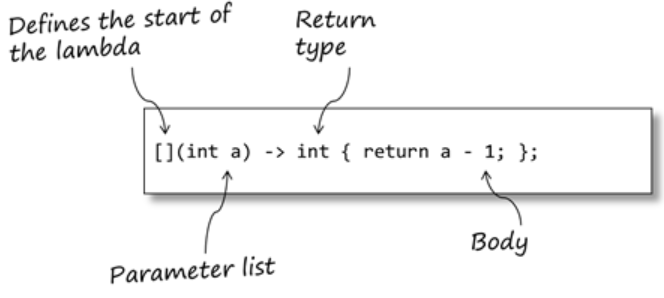

## Introduction 

사실 가장 다루고 싶었던 것은 함수형 프로그래밍이었다. 
Modern C++의 가장 큰 특징은, 반복적으로 사용하는 패턴을 미리 library화하여 성능과 메모리를 최적화해두었다는 점이다.

만약 이 글을 읽고 있는 독자에게 '{1, 2, 3, 4, 5}의 vector가 있을 때 각 요소에 2를 곱해 2배로 만드는 코드를 짜라'고 했을 때, 머릿속에서 아래와 같이 그려진다면:

```cpp
std::vector<int> src = {1, 2, 3, 4, 5};
std::vector<int> dst;
for (int i = 0; i < src.size(); i++) {
    dst.emplace_back(src[i] * 2);
}
```

이 시리즈를 정독해보면 큰 도움이 될 것이다. 함수형 프로그래밍을 잘 활용하면 아래와 같이 코드를 작성할 수 있다:

```cpp
std::vector<int> src = {1, 2, 3, 4, 5};
std::vector<int> dst;
dst.resize(src.size());
std::transform(src.begin(), src.end(), dst.begin(), [](int x) { return x * x; });
```

'뭐야 똑같이 네 줄이구만 ㅋ ㅋ'이라고 생각할 수 있겠지만, 함수형 프로그래밍의 가장 큰 장점은 모듈화와 확장성이다. 즉, 함수형 프로그래밍을 통해 다른 함수를 인자로 다시 재사용해서 코드를 작성할 수 있다. 
이는 코드의 재사용성을 높여 유지보수를 쉽게 만든다. 또한 (친숙해진다면) 코드가 간결해져서 가독성 또한 높일 수 있다.
([여기](https://limhyungtae.github.io/2024-01-01-Modern-C++-for-Robotics-4.-std-for_each()-%EC%89%AC%EC%9A%B4-%EC%84%A4%EB%AA%85-&-%EC%98%88%EC%A0%9C/)에서 다시 설명하겠지만, 이는 또한 병렬 처리를 할 때 큰 장점이 된다. Robotics 분야 같이 real-time으로 동작하는 게 생명인 분야에서는 병렬 처리만 좀 잘해줘도 알고리즘이 효율적인 척 할 수 있기 때문에 알아두면 피가 되고 살이 될 것이다).

함수형 프로그래밍을 잘 활용하려면 크게 두 가지를 알아야 한다: a) Lambda expression과 b) STL에서 제공하는 알고리즘들이다.
따라서 앞으로는 이 두 가지에 대해 알아보도록 한다.
함수형 프로그래밍은 자체에 대해 좀 더 자세히 알고 싶은 사람은 [여기](https://mangkyu.tistory.com/111) 설명이 잘 되어 있으니 참고하면 좋을듯 하다.

## Lambda Expression이란 

먼저 lambda expression에 대해 알아보자. lambda expression은 C++11부터 지원되는 기능으로, 함수를 정의하지 않고도 함수를 사용할 수 있게 해준다. 위에 예시를 다시 보면

```cpp
[](int x) { return x * x; }
```

요런 요상한 꼴의 인자가 std::transform의 입력으로 사용되는 것을 볼 수 있다. 
이것을 바로 Lambda expression이라고 한다 (사실 Modern C++에만 있는 것은 아니고, Python이나 다른 언어에서도 이 Lambda expression이 존재한다).
아마 독자들 중 한번이라도 C++에서 sorting을 해봤다면, 아래와 같이 sort 코드를 통해 요소를 정렬해본 경험이 있을 것이다:

```cpp
#include <iostream>
#include <vector>
#include <algorithm>

// 비교 함수 정의
bool compare(int a, int b) {
    return a > b;  // 내림차순 정렬을 위해 'a'가 'b'보다 클 때 true 반환
}

int main() {
    // 정렬할 벡터
    std::vector<int> numbers = {4, 1, 3, 9, 7, 5, 8};

    // std::sort 함수 사용, 비교 함수로 'compare' 전달
    std::sort(numbers.begin(), numbers.end(), compare);

    // 정렬된 벡터 출력
    std::cout << "Sorted in descending order: ";
    for (int num : numbers) {
        std::cout << num << " ";
    }
    std::cout << std::endl;

    return 0;
}
```

그런데 여기서 '굳이 내림차순을 하기 위해 다른 곳에 boolean 함수를 정의해야 하나?'하는 의문이 들 수 있다. 
위의 예제는 짧은 코드여서 크게 문제가 없지만, 코드가 길어지면 이런 함수를 외부에 정의하는 것이 귀찮을 수 있고,
또 다른 사람이 코드를 이해하기 위해서는 어쩔 수 없이 여러 파일을 왔다갔다하게 만들며 여러 번 보게끔 만들 가능성이 있다.
그리고 만약 sorting을 클래스 내에서 단 한번만 한다면? 단 한번만 하는 함수를 위해 추가로 함수를 선언하는 것 또한 비효율적이다.

따라서 이러한 문제를 해결하기 위해 lambda expression을 쓰게 된다.
Lambda expression을 사용하면 아래와 같이 코드를 한 줄로 간결하게 표현할 수 있다:

```cpp
std::sort(numbers2.begin(), numbers2.end(), [](int a, int b) { return a > b; });
```

즉, 외부에 함수를 따로 선언할 필요 없이 코드를 간결하게 만들어준다 (물론, lambda expression이 익숙하지 않은 이들에게는 오히려 코드의 가독성을 저하시킬 수 있다는 점도 있음을 주의해야 한다).
이처럼 프로그래밍 언어에서는 코드를 쉽게 읽고 쓸 수 있도록 하는 구성 요소나 문법을 'Syntatic Sugar'라고 부르기도 한다. 
추가적인 함수 선언 없이 & 파일의 이동 없이 코드를 이해할 수 있게 만들어주기 때문이다. 

(갑분 영어 상식: 영미권에서 '달다'는 대체로 긍정적인 느낌을 주거나 상황을 매력적으로 만든다는 의미를 가진다. 그래서 프로그래밍에서 'sugar'라는 용어는 음식에 설탕을 추가해 맛을 향상시키는 것처럼, 코드를 더 매력적이고 사용하기 쉽게 만드는 역할을 한다는 것을 나타낸다.)

## Lambda Expression의 기본 구조

Lambda expression을 처음 사용할 때 익숙하지 않기 때문에 다소 혼란스러울 수 있지만, 이를 기억하는 방법은 간단하다. 
나는 '내가 아는 괄호를 다 때려 넣으면 된다'고 외웠다. 
실제로 lambda expression은 `[](){}` 형태로, 세 개의 괄호를 사용한다. 
뒤의 두 괄호들은 원래 함수를 정의할 때 처럼 ${함수 이름}(<변수가 들어갈 곳>) {<함수 내용이 들어갈 곳>;}으로 동일하고 함수의 이름 부분만 `[]`로 대체되었다고 생각하면 외우기 쉽다.

각각의 역할을 다음과 같다.



1. \[\] 여기에는 주로 a) `&`, b) `=`, c) `(텅 빔), i.e., []`가 들어갈 수 있다. 
    - a) `&`는 참조로 변수를 받아올 때 사용한다. 
    - b) `=`는 값으로 변수를 받아올 때 사용한다. 
    - c) `[]`: 외부의 값은 추가적으로 사용하지 않겠다는 의미를 뜻한다. 즉, {} 내부가 외부의 변수를 사용하지 않는다는 의미이다. 
2. ()는 함수의 사용할 인자를 정의한다. 우리가 원래 알고 있는 함수의 꼴에서 입력 인자를 넣는 것과 동일하다. 
3. {}는 함수의 본문이 위치한다. 자명하니 생략

즉 다시 `[](int a, int b) { return a > b; }`를 살펴보면, 
1) 외부 변수 없이 
2) a, b를 받아서
3) a가 b보다 크면 true를 반환하는 함수를 뜻한다.

이렇게 간결한 표현은 STL의 algorithm 함수들과 함께 사용될 때 특히 유용하다. 함수의 이름을 별도로 지정하지 않고도 익명 함수로서 작동하기 때문이다.

다음 포스트에서는 lambda expression을 로보틱스 분야에서 어떻게 효과적으로 활용할 수 있는지 구체적인 예시와 함께 설명할 예정이다.

---

Robotics 연구자/개발자를 위한 Modern C++ 시리즈입니다.
사용된 코드들은 [여기](https://github.com/LimHyungTae/moderncpp_study)에서 확인할 수 있습니다.


