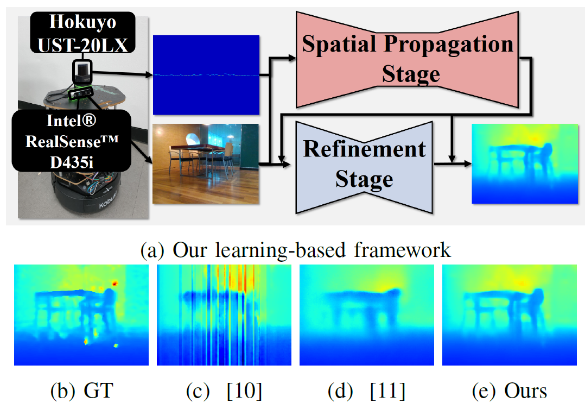
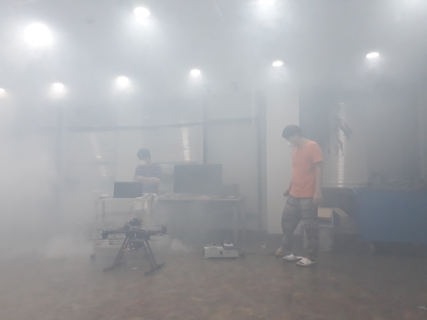
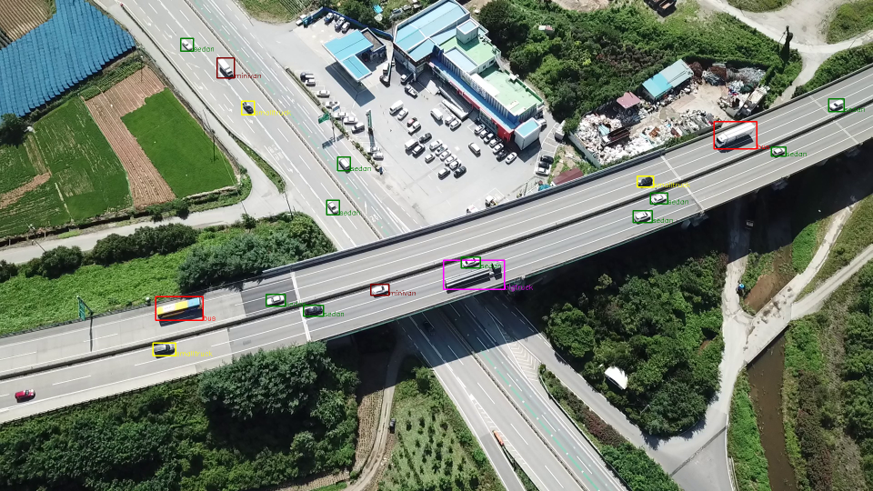

## Indoor Navigation of Mobile Robots using Deep Learning-based Object Recognition

*Supported by Samsung Electronics Co., Ltd.*

Developed SLAM algorithm applied to mobile robots. Was in charge of depth prediction using a 2D LiDAR sensor and a monocular camera for collision avoidance of mobile robots via Deep Learning.

Keywords: 2D LiDAR, Sensor Fusion, Deep Learning, Mobile Robots, PyTorch, ROS

## IITP Artificial Intelligence R&D Grand Challenge: Track 4, Intelligent Control

*Supported by IITP, which is a government-affiliated organization*

Was in charge of the task of a drone passing through windows. Implemented RGB-D camera-based path planning&following. Participated in applying VIO to achieve the Odometry of UAV.

Keywords: VIO, Path Planning and Following, Camera Geometry, OpenCV, ROS

## Range-only SLAM in Complex Disaster Situation

*Supported by Ministry of Trade, Industry, and Energy*

Implemented Monte Carlo Localization (MCL) using range measurements by Ultra-wideband (UWB) sensors for UAV from scratch single-handed. Struggled to cover None-line-of-sight (NLOS) issues.

Keywords: MCL, Beacon-based Localization, UWB sensors, NLOS, ROS

## Machine Learning-based Classification of Small Object captured by Unmanned Aerial Vehicle

*Outsourced by Pixoneer Geomatics and Agency for Defense Development*

Developed both SVM-based and Deep Learning-based classification algorithm. Implemented HOG-LBP for input to SVM and engaged in designing novel Deep Learning architecture.

Keywords: Deep Learning, SVM, HOG-LBP, Classification of Small Image patches, Python, PyTorch
